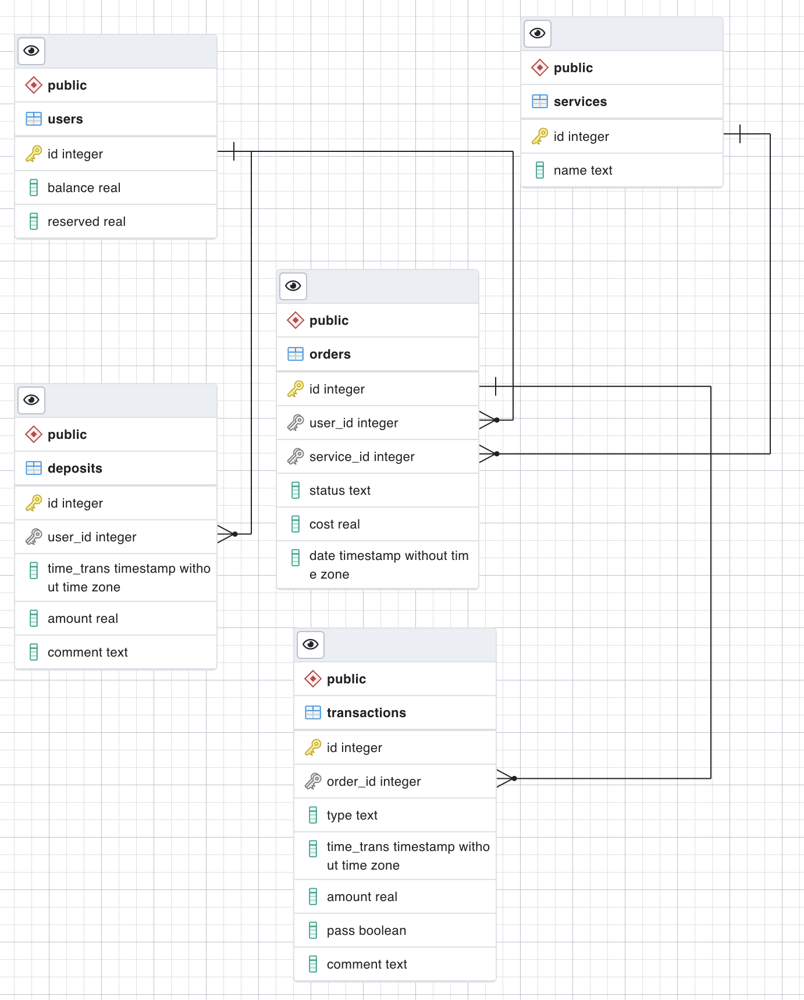
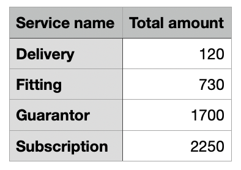

[Русский язык](README.md#Проект) [Английский язык](README.md#Project)

# Project

The application provides an HTTP API and accepts/gives requests/responses in JSON format, it itself is written in Golang. The PostgreSQL 14 DBMS was used. Docker and Swagger were also used. All the additional points of the task related to the output of data in CSV format and the output of all transactions with the condition of sorting and pagination were completed.

## Diagram Postgre



## Оглавление

1. [Getting a balance](../Ссылки/README.md####Balance)
2. [Adding funds](../Ссылки/README.md####Add)
3. [Create order](../Ссылки/README.md####Create)
4. [Revenue recognition](../Ссылки/README.md####Revenue)
5. [*Transaction output](../Ссылки/README.md####Output)
6. [*Reporting for accounting](../Ссылки/README.md####Report)

#### Balance
##### Request
```
GET http://localhost:8080/user/?id=1
```
##### Response
```json
{
  "id": "1",
  "balance": "350",
  "reserved": "0"
}
```

##### Request
```
GET http://localhost:8080/user/?id=3
```
##### Response
```json
{
  "message": "user not found with this id",
  "developerMessage": "incorrect id in request",
  "code": "0001"
}
```

##### Request
```
GET http://localhost:8080/user/?id
```
##### Response
```json
{
  "message": "not enough parameters or parameters without values",
  "developerMessage": "request invalid",
  "code": "0002"
}
```

#### Add

##### Request
```
POST http://localhost:8080/users  
Content-Type: application/json  
```

```json
{  
  "id": "1",  
  "balance": "100"
}
```
##### Response
```json
{}
```

#### Create
##### Request
```
POST http://localhost:8080/users  
Content-Type: application/json
```
```json
{  
  "orderId": "5",  
  "userId": "1",  
  "serviceId": "2",  
  "cost": "650"
  }
```
##### Response
```json
{}
```
##### Request
```
POST http://localhost:8080/order  
Content-Type: application/json  
```
```json
{  
  "orderId": "2",  
  "userId": "1",  
  "serviceId": "2",  
  "cost": "650"
}
```
##### Response
```json
{
  "message": "an order with this number has already been created",
  "developerMessage": "incorrect orderId",
  "code": "0003"
}
```

#### Revenue

##### Request
```
PATCH http://localhost:8080/user/  
Content-Type: application/json 
```

```json
{  
  "orderId": "1",  
  "userId": "1",  
  "serviceId": "2",  
  "cost": "650"
}
```
##### Response
```json
{}
```

##### Request
```
PATCH http://localhost:8080/user/  
Content-Type: application/json 
```
```json
{  
  "orderId": "1",  
  "userId": "1",  
  "serviceId": "2"  
}
```
##### Response
```json
{
  "message": "not enough parameters or parameters without values",
  "developerMessage": "request invalid",
  "code": "0002"
}
```

#### Output

##### Request
```
GET localhost:8080/trans/?id=1&sort=ASC&field=time_trans&list=1&limit=1
```
##### Response
```json
[
  {
    "name": "Subscription",
    "type": "Debiting",
    "timeTrans": {
      "Time": "2022-11-18T01:14:04.418312Z",
      "InfinityModifier": 0,
      "Valid": true
    },
    "amount": "650",
    "pass": "true"
  }
]
```

##### Request
```
GET localhost:8080/trans/?id=1&sort=ASC&field=time_trans&list=1&limit=0  
```
##### Response
```json
{
  "message": "not enough parameters or parameters without values",
  "developerMessage": "request invalid",
  "code": "0002"
}
```

#### Report
##### Request
```
GET localhost:8080/total/?year=2022&month=11   
```
##### Response
``` 
File saved in internship_backend_2022/files/total.csv
```
##### Example a file

***


***
# Проект

Приложение предоставляет HTTP API и принимает/отдаёт запросы/ответы в формате JSON, само оно написано на языке Golang. Использовалась СУБД PostgreSQL 14. Также использовался Docker и Swagger. Были выполнены все доолнительные пункты задания связанные с выводам данных в формат CSV и вывод всех транзакций с условием сортировки  и пагинации.

## Схема СУБД


## Оглавление

1. [Получение баланса](README.md####Баланс)
2. [Добавление средств](README.md####Добавление)
3. [Создание заказа](README.md####Создание)
4. [Признание выручки](README.md####Признание)
5. [*Вывод транзакций](README.md####Вывод)
6. [*Отчётность для бухгалтерии](README.md####Отчёт)

#### Баланс
##### Request
```
GET http://localhost:8080/user/?id=1
```
##### Response
```json
{
  "id": "1",
  "balance": "350",
  "reserved": "0"
}
```

##### Request
```
GET http://localhost:8080/user/?id=3
```
##### Response
```json
{
  "message": "user not found with this id",
  "developerMessage": "incorrect id in request",
  "code": "0001"
}
```

##### Request
```
GET http://localhost:8080/user/?id
```
##### Response
```json
{
  "message": "not enough parameters or parameters without values",
  "developerMessage": "request invalid",
  "code": "0002"
}
```

#### Добавление

##### Request
```
POST http://localhost:8080/users
```
``` json
{  
  "id": "1",  
  "balance": "100"
}
```
##### Response
```json
{}
```

#### Создание
##### Request
```
POST http://localhost:8080/users  
Content-Type: application/json
```
```json
{  
  "orderId": "5",  
  "userId": "1",  
  "serviceId": "2",  
  "cost": "650"
  }
```
##### Response
```json
{}
```
##### Request
```
POST http://localhost:8080/order  
Content-Type: application/json 
```
```json
{  
  "orderId": "2",  
  "userId": "1",  
  "serviceId": "2",  
  "cost": "650"
}
```
##### Response
```json
{
  "message": "an order with this number has already been created",
  "developerMessage": "incorrect orderId",
  "code": "0003"
}
```

#### Признание
##### Request
```
PATCH http://localhost:8080/user/  
Content-Type: application/json  
```
```json
  
{  
  "orderId": "1",  
  "userId": "1",  
  "serviceId": "2",  
  "cost": "650"
}
```
##### Response
```json
{}
```

##### Request
```
PATCH http://localhost:8080/user/  
Content-Type: application/json 
```

```json
{  
  "orderId": "1",  
  "userId": "1",  
  "serviceId": "2"  
}
```
##### Response
```json
{
  "message": "not enough parameters or parameters without values",
  "developerMessage": "request invalid",
  "code": "0002"
}
```

#### Вывод

##### Request
```
GET localhost:8080/trans/?id=1&sort=ASC&field=time_trans&list=1&limit=1
```
##### Response
```json
[
  {
    "name": "Subscription",
    "type": "Debiting",
    "timeTrans": {
      "Time": "2022-11-18T01:14:04.418312Z",
      "InfinityModifier": 0,
      "Valid": true
    },
    "amount": "650",
    "pass": "true"
  }
]
```

##### Request
```
GET localhost:8080/trans/?id=1&sort=ASC&field=time_trans&list=1&limit=0
```
##### Response
```json
{
  "message": "not enough parameters or parameters without values",
  "developerMessage": "request invalid",
  "code": "0002"
}
```

#### Отчёт
##### Request
```
GET localhost:8080/total/?year=2022&month=11
```
##### Response
``` 
File saved in internship_backend_2022/files/total.csv
```
##### Пример файла

***
